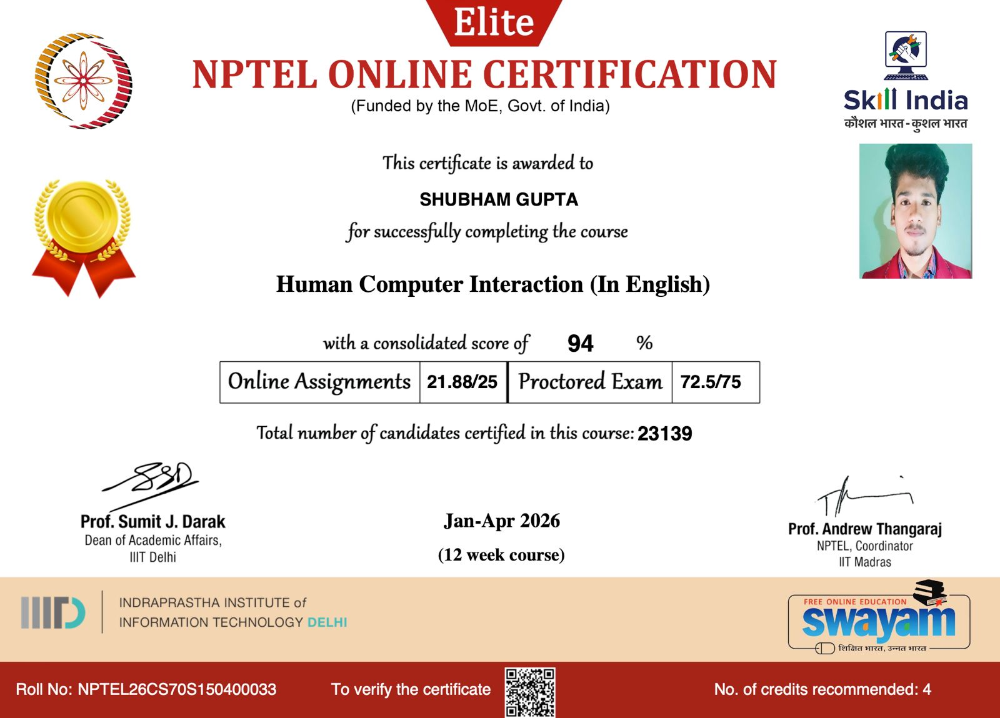

<h1 align="center">Hey, I'm Shubham 👋</h1>

  I build AI systems that go beyond demos — production-ready pipelines, 
  real UX, and logic that handles when things go wrong.  
  <b>GenAI · Full Stack · NLP · Computer Vision</b>

  
  
  
  

---

### Who I am

Third-year CS student at LPU who got tired of tutorial projects. I build actual things — an AI support system with semantic routing and human escalation, a sales intelligence tool that reads call transcripts with RAG, a real-time sign language detector. The kind of stuff you can show someone and they immediately understand what it does.

My stack is Python + JavaScript depending on what the problem needs. I'm comfortable going from model fine-tuning all the way to deploying a React frontend on Firebase.

---

### 🚀 What I'm building right now

> **ksolves-resolveAI** — enterprise AI support automation. Local LLMs, semantic routing, LLM fallback chain, audit logs, human escalation. Think: Intercom but the first responder is an AI that actually knows when to give up and hand off.

---

## 🏅 Certifications

Not just completed — **top-ranked**. Out of 23,139 candidates, I scored **94%** 
and earned the **Elite + Gold Badge** — given only to the highest percentile. 
This isn't a participation certificate.

| Course | Issuer | Score | Badge |
|---|---|---|---|
| Human Computer Interaction | NPTEL · IIT Madras | 94% | 🥇 Elite + Gold |

> Relevant to everything I build — because shipping AI products nobody can use
> is just expensive waste.

  
  
  
  
  
  
  
  

**Web & Cloud**

  
  
  
  
  
  

> *Note: GitHub shows HTML as my top language because several ML project frontends use it — the actual logic is Python. Check the repos directly.*

---

### 📊 Stats

  
  

  

---

### 📬 Let's talk

**LinkedIn:** [linkedin.com/in/shubhamgupta407](https://linkedin.com/in/shubhamgupta407)

I'm actively looking for internships and remote roles in AI/ML or full stack development.
If you're working on something interesting, I'm faster to respond than most.
